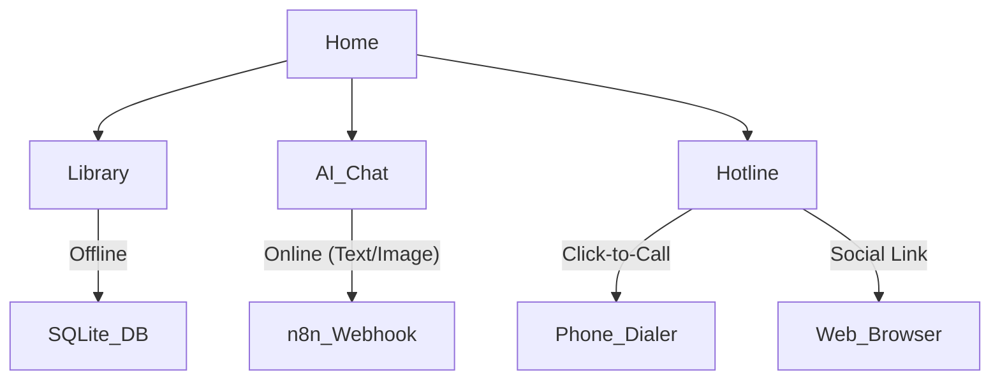
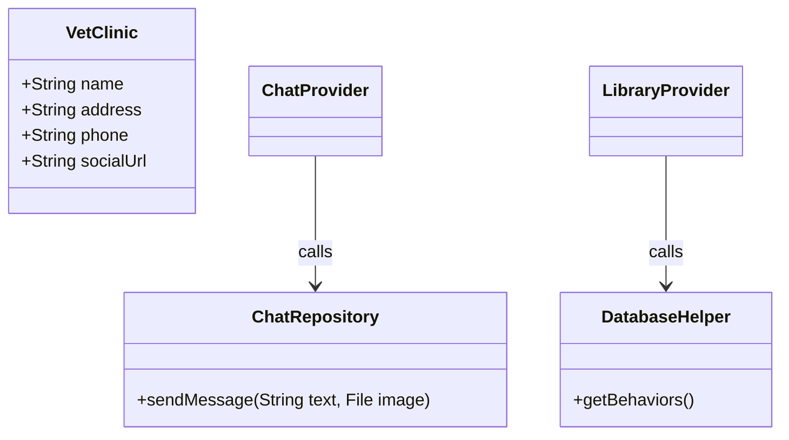

# PawSight: Design Document

## 1. Overview
**PawSight** is a hybrid (online/offline) mobile application designed to help pet owners, specifically cat owners, interpret their pet's body language. It combines a robust offline library of behaviors with online AI-powered assistance (Text + Vision) and veterinary resources.

## 2. Problem & Goal
**Problem:** Pet owners often misinterpret their animal's signals. While static guides help, specific situations can be nuanced, and owners often need immediate, interactive advice or emergency contacts.
**Goal:** To build a comprehensive companion app that offers instant offline references and advanced online AI analysis (via n8n) for deeper inquiries.

## 3. Alternatives Considered

### Data Storage: JSON vs. SQLite
- **Decision:** **SQLite** (via `sqflite`). Remains the choice for the offline behavior library to ensure efficient filtering and scalability.

### AI Integration: On-Device vs. Cloud (n8n)
- **On-Device (TFLite):** Fast, works offline, but hard to update and limited reasoning capabilities.
- **Cloud (n8n Webhook):** leveraging an external AI agent via HTTP. Allows for complex reasoning, RAG (Retrieval-Augmented Generation), and easy logic updates.
- **Vision Strategy:** The app will utilize the camera/gallery to send images to the n8n workflow for analysis, rather than processing them on-device.

### Connectivity Strategy
- **Hybrid:** The app must gracefully handle state. The Library and Emergency numbers work offline. The Chatbot requires an internet connection.

## 4. Detailed Design

### 4.1 Architecture
The application follows a **MVVM (Model-View-ViewModel)** pattern with a Repository layer for data handling.

- **Model (Data Layer):**
  - `DatabaseHelper`: SQLite connection for the offline library.
  - `ChatRepository`: Handles HTTP POST (Multipart) requests to the n8n webhook.
  - `EmergencyRepository`: Static list of national/local vet hotlines.
- **ViewModel (Logic Layer):**
  - `LibraryProvider`: Manages behaviors, search, and filtering.
  - `ChatProvider`: Manages chat history, image selection, sending messages, and n8n responses.
- **View (UI Layer):**
  - Flutter Widgets utilizing `Consumer`.

### 4.2 Database Schema (Offline Library)
**Table: `behaviors`**
| Column | Type | Description |
| :--- | :--- | :--- |
| `id` | INTEGER PK | Unique ID |
| `name` | TEXT | Short name (e.g., "Vertical Tail") |
| `category` | TEXT | Body part (e.g., "Tail", "Ears") |
| `mood` | TEXT | Emotion (e.g., "Happy", "Aggressive") |
| `description` | TEXT | Detailed explanation |
| `image_path` | TEXT | Asset path |

### 4.3 External API (AI Chatbot & Vision)
- **Endpoint:** User-configurable or hardcoded n8n Webhook URL.
- **Method:** `POST` (Multipart/form-data)
- **Payload:**
    - `message`: Text query.
    - `file`: (Optional) Image file for vision analysis.
- **Response:** `{ "reply": "AI Agent response..." }`

### 4.4 User Interface (UI)
1.  **Home Screen:**
    -   Dashboard with quick access to "Library", "AI Assistant", and "Vet Hotline".
    -   Daily Tip (Offline).
2.  **Library Screen (Offline):**
    -   Searchable list of cat behaviors.
    -   Filters (Mood, Body Part).
3.  **AI Chat Screen (Online):**
    -   Chat interface (Bubbles).
    -   Input field.
    -   **Camera/Gallery Button:** To upload images for analysis.
4.  **Emergency/Hotline Screen:**
    -   List of clinics/resources.
    -   **Clinic Card:** Displays Name, Address, Phone (Click-to-call), and Social Media Link.

### 4.5 Diagrams

**App Flow:**

**Class Structure:**

## 5. Summary
PawSight is a robust "Field Guide" for pet owners. It provides offline reliability for common behaviors and online intelligence (via n8n) for complex analysis, including visual interpretation of pet photos.

## 6. References
- **Http Package:** [https://pub.dev/packages/http](https://pub.dev/packages/http)
- **Image Picker:** [https://pub.dev/packages/image_picker](https://pub.dev/packages/image_picker)
- **Sqflite:** [https://pub.dev/packages/sqflite](https://pub.dev/packages/sqflite)
